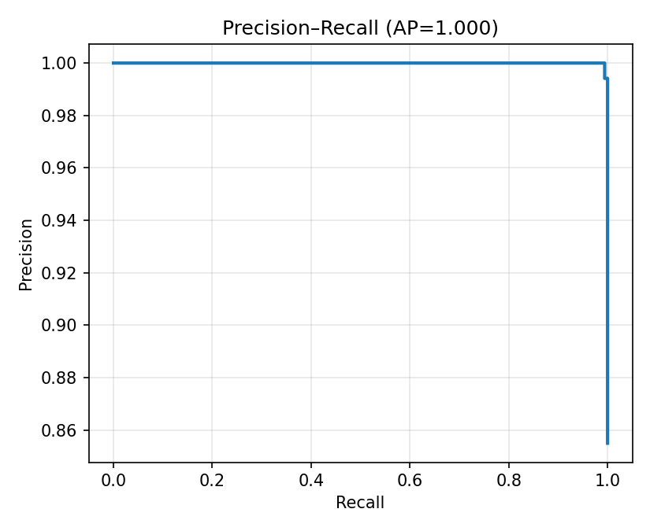

# VisMod

Vismod is a neural network–powered tool designed to automatically moderate visual content, ensuring image data is appropriate for general audiences. Designed for speed and scalability, it helps businesses automate content safety using modern computer vision techniques.

# How To

## Install Docker
[Install Docker](https://docs.docker.com/desktop/), the CLI is the most important part. Administrative permissions will be required.

## Run Docker
Choose whether to run with a CPU or GPU, then build the docker container from the project root directory (vismod/).

### Use CPU-Only:
```bash
	make build-cpu     # build slim version
```
### Use GPU:
```bash
	make build-gpu     # CUDA-optimized build
```

### Optional Commands
- Docker image cleanup:
```bash
	make clean         # optional image cleanup
```
- Shell into container (GPU used, if available):
```bash
	make run
```

## Train the Model:
1. Configure the model to your liking:
```
configs/mod_classifier.yaml
```
2. Structure your data in this manner:
```
your-data-dir/
	├── train/
	│   ├── safe/
	│   └── not/
	├── val/        # optional
	│   ├── safe/
	│   └── not/
	├── test/       # optional
	    ├── safe/
	    └── not/
```
3. Run a training job:
```bash
	make train
```
### Optional Commands
- Specify a new model
```bash
	# With a different config file
	make train CONFIG=configs/alt_model.yaml
```
- Force CPU
```bash
	make train USE_GPU=0   # Force CPU
```
- Force GPU
```bash
	make train USE_GPU=1   # Force GPU
```
- Specify a data directory
```bash
	make train DATA_DIR=your-data-dir	# With a different config file
```

## Evaluate the Model:
Compute metrics on a held-out (unseen) test set to approximate how well the model would perform on unseen data. It is recommended to evaluate the model before running inference. For the DATA_DIR, just give the absolute path to the root of your data, just like you did for model training. The evaluation uses the **your-data-dir/test** data.
```bash
	make eval CHECKPOINT=my.ckpt DATA_DIR=your-data-dir
```
### Optional Commands
- Force CPU
```bash
	make eval CHECKPOINT=my.ckpt DATA_DIR=your-data-dir USE_GPU=0   # Force CPU
```
- Force GPU
```bash
	make eval  CHECKPOINT=my.ckpt DATA_DIR=your-data-dir USE_GPU=1   # Force GPU
```
- Populate the README.md with the latest evaluation results:
```bash
	make eval USE_GPU=1 REPORT=1 \
		CHECKPOINT=weights/default.ckpt \
  		DATA_DIR=data
```

## Run Inference:
- Run on 1 image or an entire directory:
```bash
	make infer CHECKPOINT=my.ckpt INPUT=my_data/test
```
### Optional Commands
- Custom output directory
```bash
	make infer CHECKPOINT=my.ckpt INPUT=my_data/test OUTPUT=my_dir	# Custom output directory
```
- Force CPU
```bash
	make infer CHECKPOINT=my.ckpt INPUT=my_data/test USE_GPU=0   # Force CPU
```
- Force GPU
```bash
	make infer CHECKPOINT=my.ckpt INPUT=my_data/test USE_GPU=1   # Force GPU
```
- Set the number of entries per log partition.
```bash
	make infer CHECKPOINT=my.ckpt INPUT=my_data/test SAMPLES_PER_FILE=1000
```
- Set the number of CPU workers used to run inference.
```bash
	make infer CHECKPOINT=my.ckpt INPUT=my_data/test WORKERS=16
```

## Miscellaneous:
- To re-lint the code:
```bash
	make format		# format with yapf (2-space config)
```
- Make example dataset using imagenette:
```bash
	make build-dataset DATA_DIR=my_data
```
- See runtime information:
```bash
	make {train/infer/eval} VERBOSE=1 ...
```

## Visualize Results:
- Run Jupyter Notebook (GPU)
```bash
	make notebook 
```
Access the notebook in your web browser at: ```http://localhost:8888/lab?```
- Force CPU
```bash
	make notebook USE_GPU=0   # Force CPU
```
- Force GPU
```bash
	make notebook USE_GPU=1   # Force GPU
```

## Example Results:



<!-- PERF:START -->
### Model Performance

    | Metric | Value |
    |---|---|
    | Best threshold (P(Not)) | 0.320 |
    | Accuracy | 0.990 |
    | Precision | 0.988 |
    | Recall | 1.000 |
    | F1 | 0.994 |
    | AUC (ROC) | 1.000 |
    | Average Precision (PR) | 1.000 |
<!-- PERF:END -->


